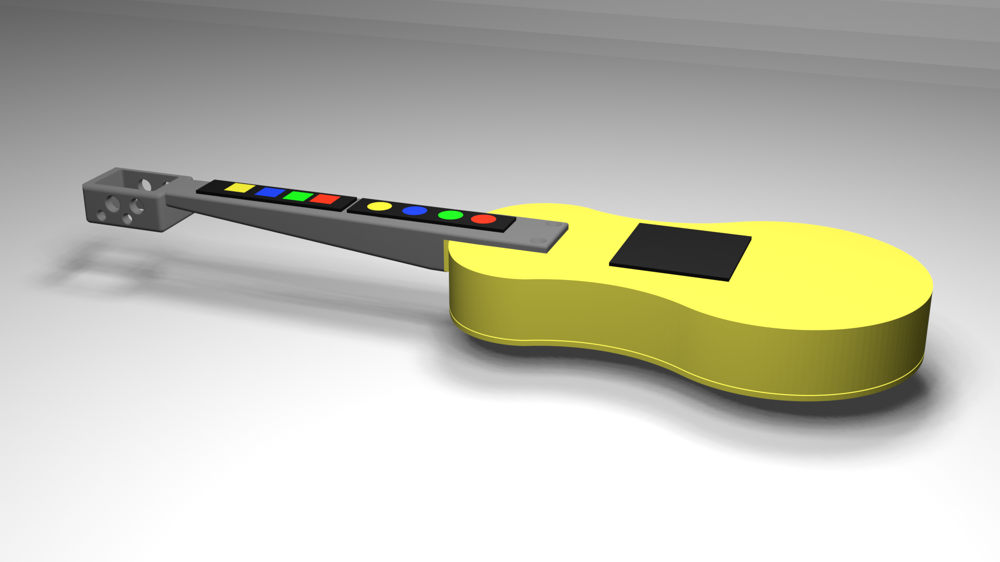

# GUITALELE

Este proyecto está basado en el prototipo Trill Guitar de la web de Bela y para la impresión 3D nos hemos basado en un modelo 3D publicado en Printables.
Prototipo 1: #[Trill Guitar](https://blog.bela.io/creating-a-guitar-with-trill-and-raspberrypi/).
Prototipo 2: #[Ukelele 3D](https://www.printables.com/model/791551-ukulele).
Se trata de un ukelele o de una guitarra pequeña, con sensores táctiles que permite tocar acordes pregrabados con solo pasar el dedo por el sensor que está donde las cuerdas de la guitarra. Los sensores del traste permites seleccionar el acorde que va a sonar. Está prototipado con una placa [Bela](https://bela.io/), y el código para la gestión de los sensores y la reproducción de los audios es [Pure Data](https://puredata.info/). 

Adaptaciones: 
* Se ha sustituído la Raspberry Pi por una placa Bela, con motor de audio propio en Pure Data.
* Se ha modificado ligeramente el modelo para permitir el cableado de los trill.
* Se han programado los sensores trill para permitir la interpretación de acordes.
* Se ha eliminado la pantalla al menos, en su primera versión.

## MATERIALES DE LA PARTE ELECTRÓNICA

### Versión 1. V1.
* Placa Bela mini.
* Sensor Trill tipo bar x2
* Sensor Trill tipo square
* Sensor hub
* Cables de pin para alargar las conexiones.
* Powerbank.

## CONSTRUCCIÓN

### Lista de materiales: 

* 1 x placa Bela: [https://eu.shop.bela.io/collections/bela-and-bela-mini/products/bela-gem-stereo](https://eu.shop.bela.io/collections/bela-and-bela-mini/products/bela-gem-stereo?variant=57799327646077) (78€)
* 2 x sensores trill bar: [https://eu.shop.bela.io/collections/trill/products/trill-bar](https://eu.shop.bela.io/collections/trill/products/trill-bar) (18€)
* 1 x sensor tril square: [https://eu.shop.bela.io/collections/trill/products/trill-square](https://eu.shop.bela.io/collections/trill/products/trill-square) (18€)
* 1 x sensor trill hub: [https://eu.shop.bela.io/collections/trill/products/trill-hub](https://eu.shop.bela.io/collections/trill/products/trill-hub) (12€)
* 1 x cable usb: [ejemplo en amazon](https://www.amazon.es/JZK-unidades-proyectos-bricolaje-conector/dp/B0F8NCX9Q4/ref=sr_1_20?__mk_es_ES=%C3%85M%C3%85%C5%BD%C3%95%C3%91&crid=1E3PYWSIAU2HS&dib=eyJ2IjoiMSJ9.I3Rg1CgQCgnTmSMVAkhAZfHew_fT0aTp0p-jnpLwc2bfjs9c7klDuj2j44XgwZrannGf3uGbodJ-jBfaVPVmnVstcur3JsmBhXTgz2aYGkEUUQHfBeImvdOEUz42k_b_Di_zZUOsJ57PmmwwrU4i8K0OwMCDCJKj_IStMQK2aBSpwnAQM5a-_4o_W5zUcV0pAJpb2vtQMLBMqsJYIn5bzMRSj607R_xnA3sCZbDeCSzTVt1OtrEn07Drg_IcAGe5uIJSEg8qLCZx6p8maFKwjC3kopqfb00vRXdDD2JakDI.MZBnclUBaftFjjXKftYQrmwYNlBbNGgCQPCc0S8Z5S0&dib_tag=se&keywords=usbc+power+cable&qid=1772741653&sprefix=usbc+powercable%2Caps%2C261&sr=8-20) (10 x 6€)
* 1 x cables de audio: [https://eu.shop.bela.io/collections/extras/products/audio-adapter-cables-3](https://eu.shop.bela.io/collections/extras/products/audio-adapter-cables-3) (7€)
* 1 x cable molex para alargar uno de los sensores: [ejemplo en amazon](https://www.amazon.es/InLine-transmisi%C3%B3n-veloc%C3%ADmetro-Ventilador-33328M/dp/B0FC6KS4T2/ref=sr_1_47?__mk_es_ES=%C3%85M%C3%85%C5%BD%C3%95%C3%91&crid=1FAQ3U6B4HRAQ&dib=eyJ2IjoiMSJ9.27wRj6Cb_X60uoDDwg6rJ95LPzQNAtXGfG2dzfwWALWhMb-2on-sV_n9SY4FnA0Q4nk8BfJour09iAZULnPDgn5DLDiGR6UugTYDjSMcT_96pGcazHbVrUKmZHqaLAv87AtJayWAqghuZu_9FSvHcbIfb4SAg9WYc5x1f4rfozDlooERS8JYKSl7uBjXdbDrI13As1aNRh4hXSh8kzowrhcmqj6nkSQpl9GlH-4x_6dxh0CKlAob6htNy0E-YrdpOI9Z4w8nJlt1YaAi_1K-qVlC28dM6SeMwZWWUOvK-dg.ac4NkeE-55GfqwoK-k7bSiICQiVAfTTkQ9U-dyY2t0c&dib_tag=se&keywords=cable+3+pines+Molex&qid=1772741326&sprefix=cable+3+pines+molex%2Caps%2C265&sr=8-47) (6€)
* 1 x interruptor: [ejemplo de amazon](https://www.amazon.es/dp/B0CX8TRQ35?ref=ppx_yo2ov_dt_b_fed_asin_title) (4 x 8€)
* 1 x cable usb-c: hembra: [ejemplo de amazon](https://www.amazon.es/RUNCCI-YUN-conector-montaje-resistente-hebilla/dp/B0CL9F34GT/ref=sr_1_3_sspa?__mk_es_ES=%C3%85M%C3%85%C5%BD%C3%95%C3%91&crid=2ULOUEEC8IE2O&dib=eyJ2IjoiMSJ9.tsGdA7LHD6ZZd45ueKgAZ3H_5qQWjS_nR455zfgwxVbCw9rkWrkK1Fah2FZqBpECOBIKLyPDaMeBne903cXBFCAby_hjKRIdeXdjZnTKrCkyaS0O2YF8WmSKwcQuwsDRJ0cGRZX_yC8D4T3TeoXSQZfNgGUIpoUFmrq_KhnmU_sw_HHfYg-jGT6tK0E4D6Wl51sAzZ4gPOSDOFhW01YGiF0sGixtbfaknORgED45ZZo7c14QZ8JzPMUDsK8aIOzbUb9B37MWjeZvHCAsaybprwL0i47vFxWXmkQJDchlPVc.8mhfTfnYC1liZHiBepHCXIdyNoB2a9Ui4iWL6yPmShw&dib_tag=se&keywords=usb+c+female&qid=1772741410&sprefix=usb+c+fema%2Caps%2C271&sr=8-3-spons&aref=4ofBWFUna2&sp_csd=d2lkZ2V0TmFtZT1zcF9hdGY&psc=1) (10 x 8€)
* (opcion 1) 1 x bateria: [ejemplo de amazon](https://www.amazon.es/INIU-port%C3%A1til-cargador-Powerbank-compatible/dp/B07PNL5STG/ref=sr_1_5?__mk_es_ES=%C3%85M%C3%85%C5%BD%C3%95%C3%91&crid=1MCE66239RAJR&dib=eyJ2IjoiMSJ9.h4zcxfSFyBujMnpouhHexWznZKmy9Y0fPs1mMGQ_UhxFjvNlWco8G7kDT0KQ6JfRL7wIQTt4hW6s_D7Z0382DXViL8byKmNSesIYMU10QlJEts89k69-WFxrRIu5HWjHqGHCQZxh9LeiJYeSQOPN9uidKxQb8eg1G6XcS1LR_R2Y73NffK8vVQiZUWGxgPvhWkIES9VlQCKdHdZ7T1V2Ny5Tx-rMaMdjtyMJhbD3CqKRrTg7DuSrvWpNcLR76i_kDZb8qfERMlOSUSQ6t6u8SyI9G6xVZXpthig-Sff1NkM.DhVIHmxC_n1d6chkKDzh607A1-pYE0_z3TjziBA8J6A&dib_tag=se&keywords=power+bank&qid=1772741537&sprefix=powerban%2Caps%2C301&sr=8-5) (17€)
* (opcion 2) 1 x cargador para la corriente de usb c: [propuesta de amazon](https://www.amazon.es/Fuente-alimentaci%C3%B3n-Enchufe-USB-Tipo/dp/B0BYS7PKSX/ref=sr_1_10?__mk_es_ES=%C3%85M%C3%85%C5%BD%C3%95%C3%91&crid=1UWFY9VHINTL&dib=eyJ2IjoiMSJ9.l1yRV_8_Mb4dwwdPgUyFP0tOrkO1LBhBXG6hfdImDXx4vdEVzGPx_Kw2xCuFzIiJ6W9WSytnSHZshC31ul0GCW0fZTB5Wy8WYN54loH3BB3ROQBZO1QM4FASTfMzPq1IkX-8AdKLyftH-Cb-wOqvcUC4KCRnjqr738OnKH5Xoq4UH0-tju7pP5rGvvEPsfsnbJ9Y0LVTl-6LVmPbItj6syjB2CeDrj4o0L8JpkNz8vEfsqKK7a5wMHpQO-JLBk_ZuuP11jQNShhs_r0Iryfny_ljGvgyuJBUJuleFL0n698.bUpkhKV4QfekEwVzm2S0kw-zh7qCwEtnqEfpVsbW2G0&dib_tag=se&keywords=usb-c+power+adapter+5v&qid=1772741756&sprefix=usb-c+power+adapter+5v%2Caps%2C317&sr=8-10) (12€)
* 20 x horas de impresión 3d: 1€/hora => 20€

