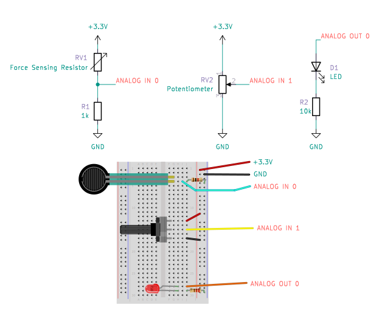
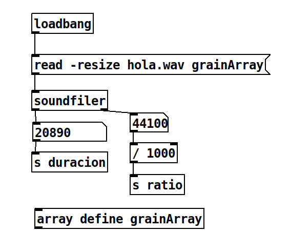
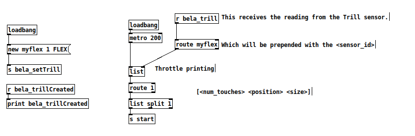
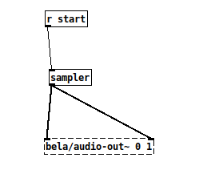
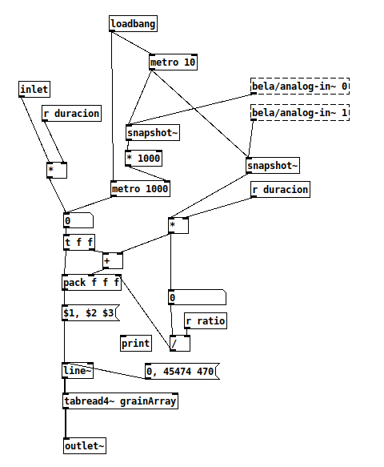

## Taller Híbridos Sonoros: del código musical al objeto resonante.

En este taller vamos a construir un instrumento musical a partir de un prototipo impreso en 3D que hace uso de sensores y controles analógicos y que se programa con código informático. En este caso, nuestro instrumento será un sintetizador sencillo que hace uso de la técnica de síntesis granular. En los siguientes apartados hay información que te puede resultar útil. 

### ¿Qué es la síntesis granular?

La síntesis granular es una técnica de creación y experimentación sonora que hace uso de granos de sonido. Granos de sonido son pequeñas fracciones de audio que se reproducen en bucle a gran velocidad para crear un sonido nuevo de gran riqueza tímbrica y de textura más o menos interesante (dependiendo del fragmento seleccionado). 

Para realizar esta síntesis de sonido digital necesitamos una muestra de audio de muy poca duración (no más de dos segundos) y un programa de software que nos permita recorrer ese material seleccionando una serie (de cantidad variable) de muestras o samples y reproducirlas en bucle a gran velocidad. Para ello, vamos a hacer uso de un sensor tácti y de dos potenciómetros conectados a una placa de desarrollo de software para música denominada Bela. Para la programación de la placa Bela usaremos el lenguaje de programación visual Pure Data.

Estos tres elementos de hardware, los dos potenciómetros y el sensor táctil, nos permiten realizar la siguiente operación: 
 * El potenciómetro A0 nos dice cada cuanto tiempo vamos a repetir el grano de sonido.
 * El potenciómetro A1 nos va a determinar el tamaño en samples de nuestro grano.
 * El sensor táctil nos va a permitir seleccionar qué parte de nuestro audio seleccionado y precargado queremos usar.

### La parte hardware

Para conectar la parte hardware lo primero es conectar los dos potenciómetros. Los potenciómetros son dispositivos analógicos pasivos (es decir que no requieren de corriente para funcionar) que cumplen la función en un circuito de ser resistencias variables de 10K ohmnios en este caso. Los potenciómetros hacen uso de tres pines, tal y como podemos ver en esta imagen:

El pin central es el que recorre la resistencia del potenciómetro en función de la posición de la rueda. Los otros dos pines (el de más izquierda y el de más a la derecha) son los que producen la diferencia de potencial de corriente eléctrica que pasa por el potenciómetro. Según la posición que tenga este, pasará más o menos corriente a través, esta cantidad de corriente es la que leemos en el pin central. Es por eso que: 
* Conectaremos el pin central de cada uno de los potenciómetros al A0 y al A1 de la placa Bela.
* Conectaremos el pin de la izquierda a GND.
* Conectaremos el pin de la derecha a 5V. 
Si conectamos los pines izquiero y derecho al revés no pasará nada, simplemente que el potenciómetro tendrá su valor máximo (generalmente a la derecha) en el lugar del valor mínimo (generalmente a la izquierda).

Por otro lado, el sistema hace uso de un sensor táctil llamado Trill Flex. Este sensor táctil contiene hasta 30 puntos de sensibilidad. e trata de un componente activo, es decir, que necesita de corriente para funcionar. La conexión de sus pines es la siguiente: 
  * El cable de color negro se conecta a GND.
  * El cable de color rojo se conecta a 3,3V.
  * El cable de color azúl se conecta a SDA.
  * El cable de color amarillo se conecta a SDL.
    
Una vez revisadas las conexiones de los elementos electrónicos podemos conectar el cable USB para enchufarlo al ordenador y los auriculares para escuchar el resultado. Podemos cerrar la caja y seguir con este tutorial para revisar la parte del código en Pure Data.

### El código informático

Este patch (que es como se denominan al código informático usado para un proyecto musical específico) consta de 3 archivos: _main.php, sampler.php y hola.wav (que es la muestra de audio que sirve de ejemplo).

#### 1. Carga de la muestra de audio y lectura de los valores esenciales

Cuando abrimos el archivo _main.pd, vemos que hay varias cosas programadas. La primera en la que nos vamos a fijar es la que aparece en la siguiente imagen: 

En estos bloques de código que aparecen en la imagen vemos cómo se lee el archivo hola.wav dentro de un array (un array no es más que un espacio reservado en memoria) y cómo el objeto `[soundfiler]` nos devuelve información acerca de este archivo, esta información es: 
 * el número de samples que tiene el archivo.
 * el sample rate o número de samples por segundo, en que fue grabado. Generalmente 44100 samples son un segundo de audio, por lo que 88200 son dos segundos, y 22050 son medio segundo. 

> Nota: 
> No es necesario tener instalado el editor de Pure Data para editar estos archivos. Los archivos .pd pueden abrirse como archivos de texto. Para este taller, para poder cambiar el sonido hola.wav de muestra, es necesario editar el archivo _main.pd. Para ello puedes abrirlo como archivo de texto y modificar la línea 5:
> #X msg 467 93 read -resize hola.wav grainArray;
> En esa línea se puede sustituir el texto hola.wav por el archivo que se quiera usar.

#### 2. Configuración y lectura del sensor táctil Trill Flex

Los sensores Trill son una familia de sensores táctiles desarrollados para la placa Bela. Requieren de una configuración inicial que nos avisa de si está todo correctamente conectado y de si el sensor es accesible para la placa. Esto lo podemos ver en la parte izquierda de la siguiente imagen:

Esta parte crea un objeto nuevo `myflex` que va a conectarse y a leer la información del sensor Trill Flex y envía un mensaje al sistema. Si el mensaje se recibe correctamente lo muestra en la consola para avisar de que todo está en orden. Sino aparece, hay que revisar las conexiones del sensor Trill. 

En la parte derecha, aparece el código para la lectura de los valores que el sensor Trill devuelve si se toca. El objeto `[metro 200]` permite realizar varias lecturas por segundo (cada 200 milisegundos) de la variable `myflex`. Actualmente solo reconoce dicha lectura si se toca con 1 dedo (de esto se encarga el objeto `[route 1]`"), para realizar lecturas de más dedos es posible, pero se sale del objetivo de este taller.

Una vez leído el valor del sensor trill se envía al sistema como variable denominada `[s start]`, porque en nuestro caso, el sensor Trill define el punto de lectura inicial de nuestro archivo de audio. 

#### 3. El código del sampler

El código del sampler está escrito en sampler.pd, pero se puede ver cómo se accede desde _main.pd. Esta capaciad de Pure Data (el lenguaje que estamos usando para programar la placa) de poder agrupar bloques de código dentro de otros bloques de código es una de las capacidades más importantes y útiles de este programa. En el archivo _main.pd, podemos ver el objeto r de recibir el mensaje start `[r start]`. Este objeto recibe del sensor Trill el valor de inicio del sample que vimos en el apartado anterior. Este mensaje se pasa al objeto sample que es una abstracción del código que veremos más abajo. El resultado de sample, que es el audio que vamos a escuchar a través del objeto `[bela/audio-out~ 1 2]`. Este objeto no hace otra cosa más que mandar el audio a los auriculares.

Si hacemos clic en el objeto `[sample]`, vemos que dentro aparece una maraña de conexiones y objetos, como aparecen en esta imagen y que vamos a tratar de organizar para se pueda enternder cómo funciona.

Por un lado tenemos los objetos `[bela/analog-in~ 0]` y `[bela/analog-in~ 1]`. Estos son los objetos que nos permiten leer lo que marcan los potenciómetros. Estos objetos devuelven un valor en formato audio. Como nosotros lo necesitamos en modo numérico, tomamos medidas cada 10 milisegundos con los objetos `[metro 10]` y `[snapshot~]`. Estos valores nos permiten calcular cada cuánto tomamos medidas de nuestro sample y con cuánta cantidad de samples respectivamente.

Como los valores de los potenciómetros se miden entre 0 y 1, hace falta realizar multiplicaciones para ajustarlos a los valores que necesitamos, por ejemplo:
* El valor del potenciómetro conectado a A0, el que tiene que determinar cuánto tiempo puede pasar como mínimo y máximo entre un sample y el siguiente, lo multiplicamos por 1000, de manera que sus valores son: mínimo 0 y máximo 1000 milisegundos, o un segundo, si quisiéramos cambiarlo, podríamos editar el archivo correspondietemente.
* El valor del potenciómetro conectado a A1, el que determina la longitud en samples de nuestro grano, se multiplica por el objeto `[r duracion]` donde duracion es la duración en samples. De manera que mínimo será 0 samples y máximo el audio completo. 

> Nota: 
> Si queremos poder escuchar el audio completo, el valor del tiempo entre una reproducción del audio grabado y la siguiente debe ser mayor o igual al tamaño del sonido, si es menor nunca podremos escuchar el audio completo porque cuando un sonido termina el tiempo dado de reproducción comienza de nuevo desde el principio. 
> Para poder usar este instrumento con otros sonidos, es necesario que el código ajuste estos valores al sonido seleccionado, si, por ejemplo, en lugar de un segundo (1000 milisegundos) dura 1,5 segundos (1500 milisegundos) o 2,1 segundos (2100 milisegundos). 

### Pasos para prepararse para la performance

#### 1: Revisar que todas las conexiones están bien.

Revisa el apartado de harware si no lo has hecho ya y revisa que las conexiones están correctamente según se describe ahí, tanto de los potenciómetros como del sensor Trill Flex.

#### 2: Busca y descarga un audio diferente.

El material fundamental que usa este instrumento se trata del archivo de audio que carga en memoria. En función de cómo sea ese audio, cambiará totalmente el sonido. No es fácil imaginarse cómo sonará un sonido una vez se realiza la síntesis granular, pero se pueden hacer varias pruebas. 

Descarga un sonido nuevo, corto, de interés tímbrico desde freesound.org (hay que crearse una cuenta gratuíta en la plataforma previamente). Apunta la duración en segundos y si lo pone, el sample rate al que está grabado. Luego ajusta los siguientes parámetros en los archivos _main.pd y sample.pd:
* en el _main.pd cambia el nombre del archivo que acabas de subir a la placa bela.
* en el sample.pd ajusta en el A0, el valor de multiplicación para que se ajuste a la dirección del sonido.

Enciende la placa Bela y pruéba tu audio.

#### 3: Explora sonidos, rítmos y juega con el instrumento desde una escucha activa.

Una vez hayas encontrado un sonido interesante, ponte los auriculares y prueba tu instrumento, explora todas las posibles combinaciones de grano a diferentes distancias, viendo cómo suenan, seleccionando qué opciones te gusta más (aproximadamente) y trando de memorizar (o puedes marcar con rotulador sobre la tapa del instrumento) qué valores son. 

De cara a la performance, juntante con otro instrumento y buscad qué sonido o sonidos podríais seleccionar para empezar, cómo continuaríais, es decir qué añadiríais y/o qué quitaríais buscando contraste, repetición, variabilidad, agregación o reducción, acumulación de sonidos y luego pensad un final. No tiene que ser larga, pero si hay que tratar de que exprese algo. 

En general suele ser interesante mezclar diferentes sonidos, Por ahora cada instrumento tiene solo un sonido, busca acompañarte de compañeros o compañeras con material sonoro diferente al tuyo.